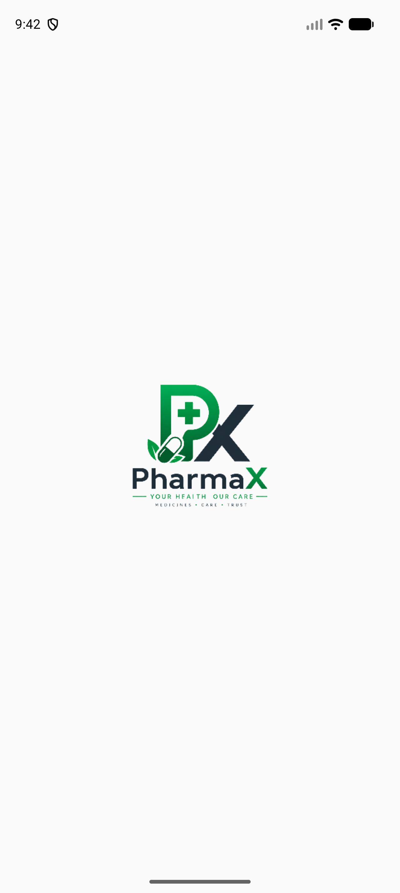
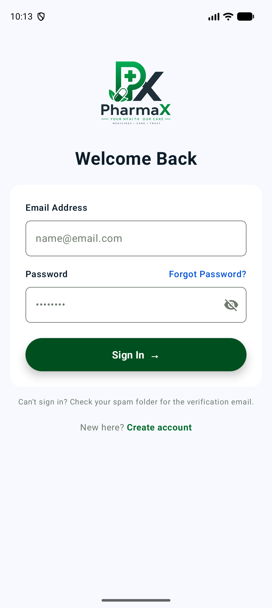
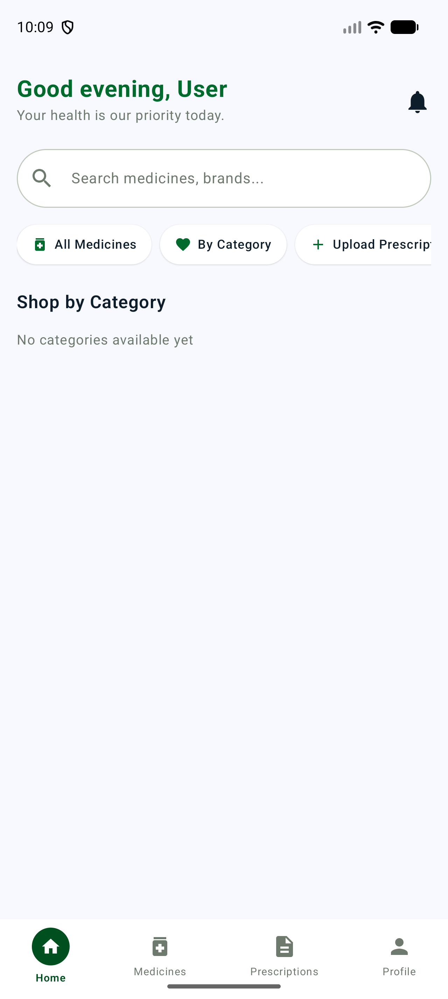
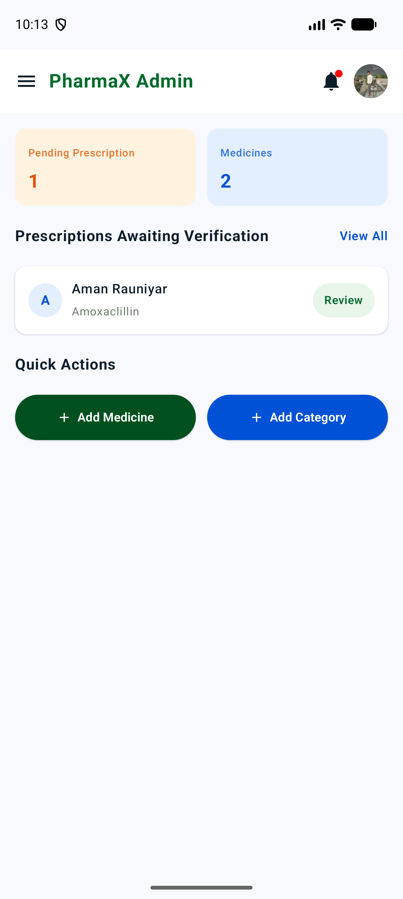
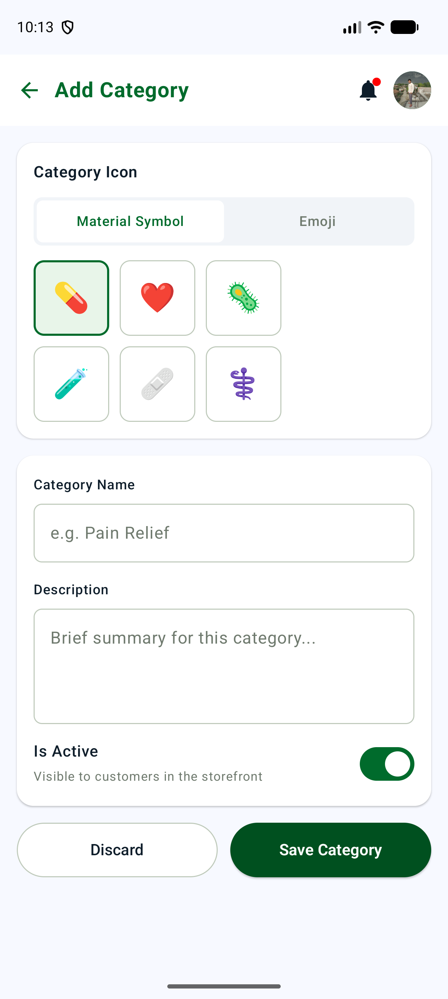

<p align="center">
  
</p>

# PharmaX — Online Pharmacy Android App

**PharmaX** is a native Android pharmacy app built with Kotlin and Jetpack Compose that lets customers browse, order, and pay for medicines from their phone — with prescription uploads, real-time order tracking, and Khalti payments — while giving admins complete control over the medicine catalogue, categories, prescriptions, and orders through a dedicated admin panel.

&nbsp;

## Table of Contents

- [Introduction](#introduction)
- [Features](#features)
- [Architecture](#architecture)
- [Tech Stack](#tech-stack)
- [Project Structure](#project-structure)
- [Database Models](#database-models)
- [Getting Started](#getting-started)
- [Testing](#testing)
- [Screenshots](#screenshots)
- [User Roles](#user-roles)
- [Author](#author)

&nbsp;

## Introduction

PharmaX solves the problem of having to physically visit a pharmacy for every medicine purchase. A customer signs up, verifies their email, browses the medicine catalogue by category, views detailed medicine information, and buys a medicine directly from the app. For prescription-only (Rx) medicines, the customer uploads a prescription — naming it for easy reuse later — and can place the order immediately without waiting for pharmacist approval, paying through the Khalti payment gateway.

On the other side, the admin panel gives pharmacy staff full visibility: manage the medicine catalogue and categories, verify uploaded prescriptions (approve or reject with a comment), review customer orders, and track everything from a single dashboard with live counts and quick actions.

The project is built end-to-end as an individual effort to practice production-style native Android development: Jetpack Compose with Material 3, an MVVM architecture, Firebase (Authentication + Realtime Database) as a serverless backend, Cloudinary for image hosting, and a live integration with the Khalti Payment Gateway Android SDK.

&nbsp;

## Features

### For Customers

- Sign up and sign in with Firebase email/password authentication, plus email verification and a forgot-password flow
- Browse medicines by category, or view the full catalogue
- View detailed medicine info — description, dosage, ingredients, how-to-use, price, and prescription requirement
- Upload and name prescriptions for Rx medicines, so they're easy to pick out later
- Select a prescription that's still pending pharmacist approval when ordering — no need to wait before buying
- Buy medicines and pay through the **Khalti** payment gateway
- Get redirected straight to order history after a successful purchase
- View your most recent order right on the dashboard, and the full order history in My Orders
- Real-time in-app notifications for prescription and order updates
- Profile management — upload/remove a profile photo (via Cloudinary), edit name and phone, change password
- Light/dark theme toggle, persisted per user
- Bottom navigation for quick access to Home, Medicines, Prescriptions, and Profile

### For Admins

- Admin dashboard with live counts — pending prescriptions and total medicines — plus a quick-review list of prescriptions awaiting verification
- Medicine catalogue management — add, edit, and view medicines with images, pricing, quantity, dosage, and ingredients
- Category management — add, edit, and toggle categories active/inactive, with duplicate-name validation
- Prescription verification — review uploaded prescription images and approve or reject them with a comment
- Order management — view all customer orders with payment status
- Admin profile management, with its own profile photo
- Notification center for admin-relevant events (e.g. new prescription submissions)
- Persistent side-navigation drawer across every admin screen

### Shared

- Firebase Authentication-backed session that persists across app restarts
- Role-based routing — a `role` field on the user record determines whether the app lands on the customer dashboard or the admin dashboard
- Real-time data sync via Firebase Realtime Database listeners (no manual refresh needed)
- Fully Compose-based, responsive UI across phone screen sizes
- Single launcher icon — the app always opens from the splash screen, regardless of which screen was open when it was last closed

&nbsp;

## Architecture

PharmaX has no separate backend server — Firebase acts as the entire backend, and the app follows a standard MVVM architecture on top of it.

```
Jetpack Compose UI (Activity + Composables)
    │
    │  observes StateFlow / sends user actions
    ▼
ViewModel
    │
    │  calls repository interface
    ▼
Repository (interface + impl)  ─────────────────────▶  External APIs
    │                                                    (Cloudinary, Khalti)
    ▼
Firebase SDK
    │
    ▼
Firebase Authentication + Realtime Database
```

**Layer responsibilities**

| Layer | Responsibility |
|---|---|
| View (Activity + Composables) | Render UI, collect ViewModel state via `StateFlow`, forward user actions |
| ViewModel | Hold UI state, validate input, call the repository, expose results as `StateFlow` |
| Repository (interface + impl) | Abstract all Firebase / Cloudinary / Khalti calls behind a testable interface |
| Model | Plain Kotlin `data class`es mapped directly to Firebase Realtime Database nodes |

Repositories are constructor-injected with a default implementation (e.g. `PrescriptionViewModel(private val repo: PrescriptionRepo = PrescriptionRepoImpl())`), which keeps ViewModels unit-testable with mocked repositories without needing a DI framework.

&nbsp;

## Tech Stack

| Layer | Technology |
|---|---|
| Language | Kotlin |
| UI Toolkit | Jetpack Compose (Material 3) |
| Architecture | MVVM (Model-View-ViewModel) |
| Backend | Firebase Realtime Database + Firebase Authentication (serverless) |
| Async / State | Kotlin Coroutines, `StateFlow` |
| Image Loading | Coil |
| Image Hosting | Cloudinary (unsigned upload preset) |
| Payments | Khalti Payment Gateway (Android SDK, sandbox) |
| Networking | OkHttp (Khalti payment initiation) |
| Unit Testing | JUnit4, Mockito, mockito-kotlin |
| Instrumented Testing | Espresso, Compose UI Test |
| Min SDK | 31 (Android 12) |
| Target / Compile SDK | 36 |

&nbsp;

## Project Structure

```
PharmaX/
├── app/
│   ├── google-services.json        # Firebase config (per-developer, gitignored)
│   └── src/
│       ├── main/
│       │   ├── AndroidManifest.xml
│       │   ├── java/com/example/pharmax/
│       │   │   ├── model/          # UserModel, MedicineModel, CategoryModel,
│       │   │   │                   # PrescriptionModel, OrderModel, NotificationModel
│       │   │   ├── repo/           # One interface + Impl per resource
│       │   │   │                   # (User, Medicine, Category, Prescription, Order,
│       │   │   │                   #  Notification, Image, Khalti)
│       │   │   ├── view/           # Activities + Composable screens
│       │   │   │                   # (Auth, Dashboard, Browse, Buy, Admin*, ...)
│       │   │   ├── viewmodel/      # One ViewModel per resource
│       │   │   ├── ui/theme/       # Color, Type, Theme, AppThemeState (dark mode)
│       │   │   └── PharmaXApp.kt   # Application class (Cloudinary init)
│       │   └── res/                # drawable, mipmap (adaptive launcher icon), values, xml
│       ├── test/                   # JUnit + Mockito unit tests
│       └── androidTest/            # Espresso + Compose UI instrumented tests
├── build.gradle.kts
├── gradle/libs.versions.toml
└── local.properties                # Cloudinary + Khalti keys (gitignored)
```

&nbsp;

## Database Models

Firebase Realtime Database is organized as a set of top-level nodes, one per resource:

| Node | Purpose |
|---|---|
| `users` | Registered accounts — name, email, phone, role (`user`/`admin`), profile photo URL, dark mode preference |
| `categories` | Medicine categories with an icon and an active/inactive toggle |
| `medicines` | Full medicine catalogue — name, brand, category, price, quantity, dosage, ingredients, Rx/OTC type, image |
| `prescriptions` | Uploaded prescription images with a user-given name, status (`Pending` / `Approved` / `Rejected`), and admin comment |
| `orders` | Placed orders — medicine, quantity, total amount, linked prescription, payment status, Khalti transaction ID |
| `notifications` | In-app notifications, keyed by recipient (a specific user or the shared admin bucket) |

&nbsp;

## Getting Started

### Prerequisites

- Android Studio (recent stable) with an emulator or physical device running Android 12+ (API 31+)
- A Firebase project with **Authentication** (Email/Password) and **Realtime Database** enabled
- A Cloudinary account with an unsigned upload preset
- A Khalti sandbox merchant account ([test-admin.khalti.com](https://test-admin.khalti.com))

### Setup

**1. Clone the repository**

```bash
git clone https://github.com/rauniyar-aman/PharmaX.git
cd PharmaX
```

**2. Firebase**

- Create a Firebase project, enable **Authentication → Email/Password** and **Realtime Database**.
- Download `google-services.json` from the Firebase console and place it at `app/google-services.json`.
- Set proper Realtime Database security rules before going beyond local testing — the default test-mode rules allow anyone to read/write the whole database.

**3. `local.properties`**

Add your own keys (this file is gitignored):

```properties
sdk.dir=/path/to/your/Android/Sdk

CLOUDINARY_CLOUD_NAME=your_cloud_name
CLOUDINARY_UPLOAD_PRESET=your_unsigned_preset

KHALTI_SECRET_KEY=your_khalti_test_secret_key
KHALTI_PUBLIC_KEY=your_khalti_test_public_key
KHALTI_BASE_URL=https://dev.khalti.com/api/v2/
```

**4. Run**

Open the project in Android Studio, let Gradle sync, and run the `app` configuration on an emulator or device.

The first registered account is a regular customer by default — promote an account to admin by setting `"role": "admin"` on that user's record directly in the Firebase Realtime Database console.

&nbsp;

## Testing

```bash
# Unit tests (JVM, no device needed)
./gradlew testDebugUnitTest

# Instrumented tests (needs a running emulator or connected device)
./gradlew connectedDebugAndroidTest
```

&nbsp;

## Screenshots

| Splash | Sign In |
|---|---|
|  |  |

| Dashboard | Admin Dashboard | Add Category |
|---|---|---|
|  |  |  |

&nbsp;

## User Roles

On sign-up, every user is a **Customer** by default. The **Admin** role is assigned directly in the Firebase console. Each role lands on a different dashboard and has access to a different set of features:

| | Customer | Admin |
|---|---|---|
| Browse & buy medicines | ✓ | — |
| Upload & select prescriptions | ✓ | — |
| Pay with Khalti | ✓ | — |
| Track orders | ✓ | — |
| Manage medicine catalogue | — | ✓ |
| Manage categories | — | ✓ |
| Verify prescriptions | — | ✓ |
| View & manage all orders | — | ✓ |

&nbsp;

## Author

Built and maintained as an individual project by **Aman Rauniyar**.

If you found this project useful, a ⭐ on the repo is appreciated.
